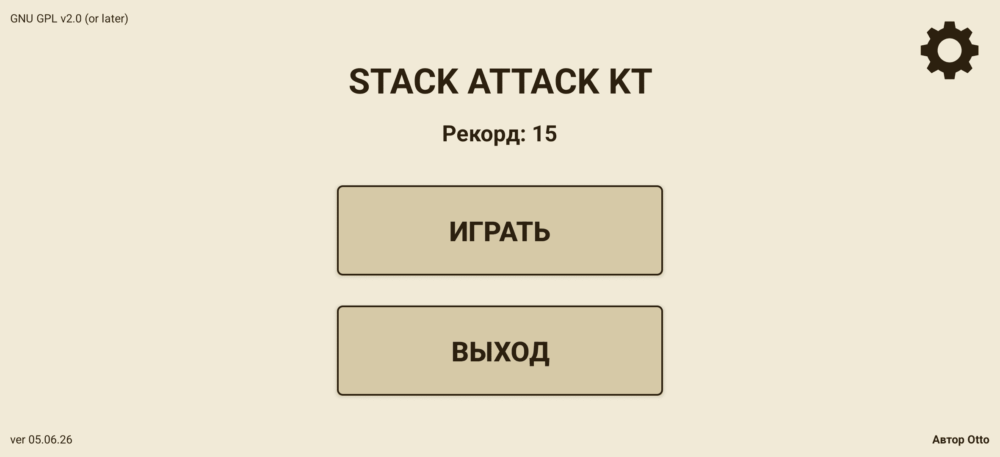
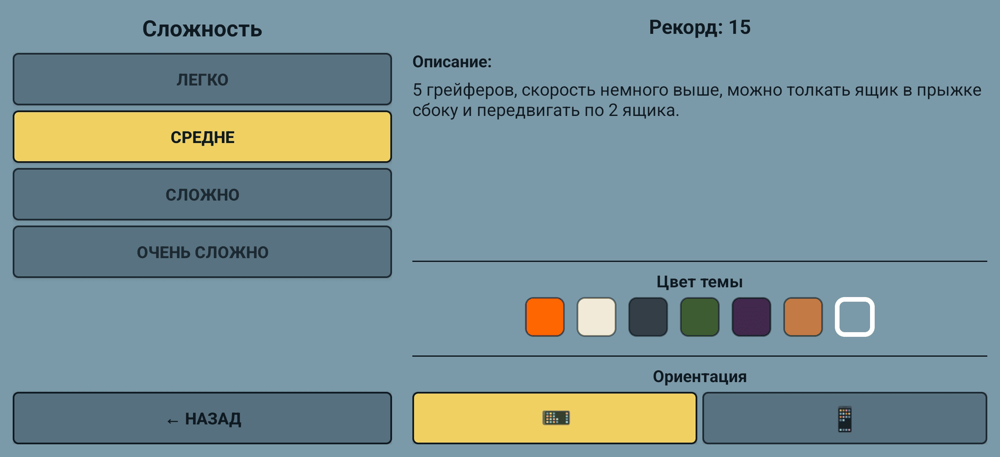
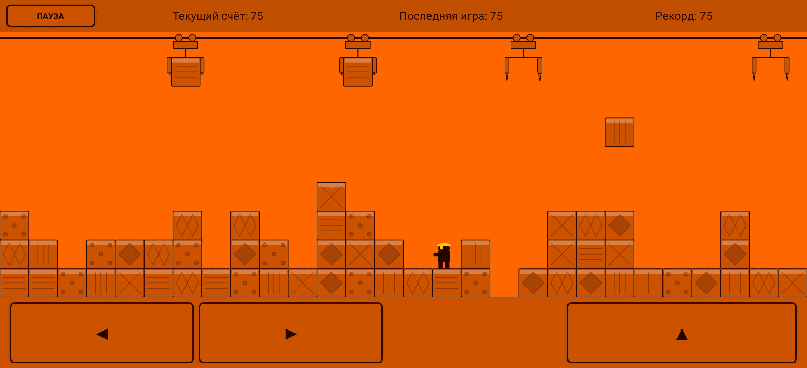
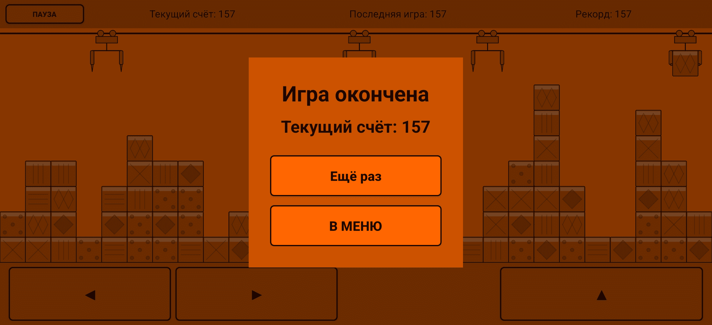
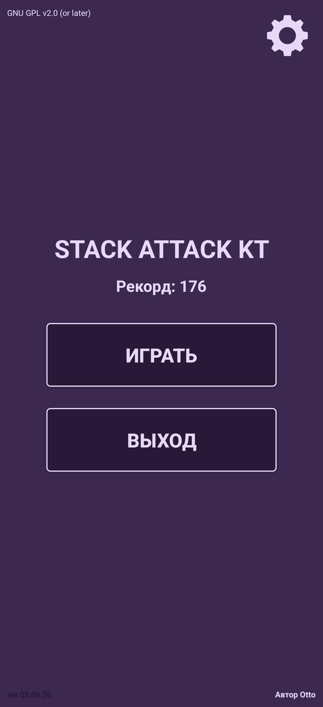
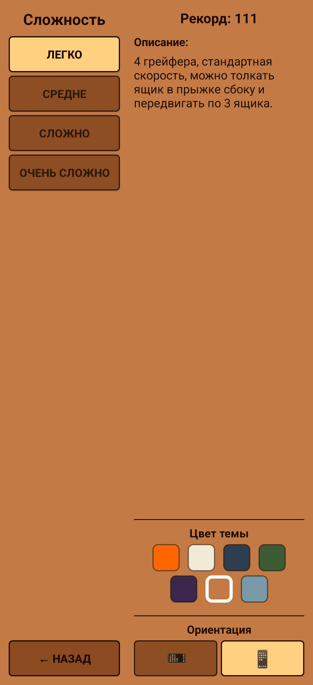
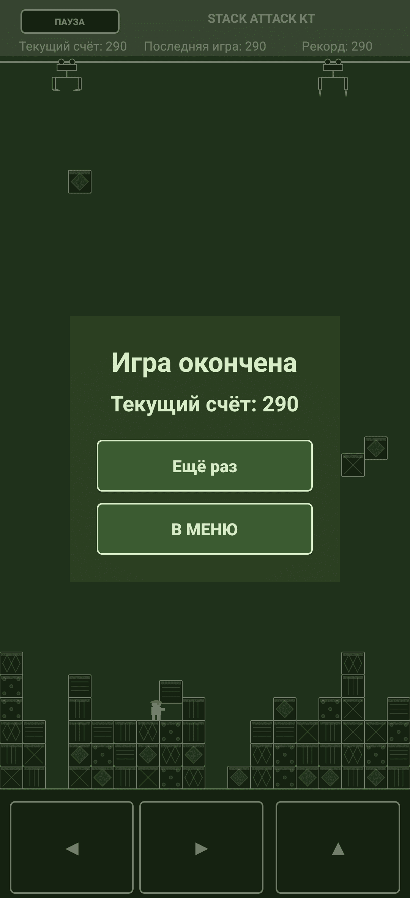
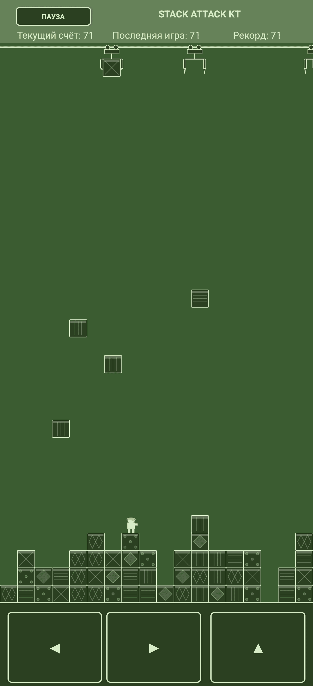

## Stack Attack Kt

Ностальгическая аркада для Android по мотивам легендарной игры с кнопочных телефонов Siemens.

Вы — грузчик на складе. Грейферы сверху сбрасывают ящики, а ваша задача — выстраивать их в сплошные ряды. Полный ряд исчезает и приносит бонусные очки. Падение ящика на голову означает конец игры. Толкайте ящики, прыгайте и сбивайте их в полёте на лёгких уровнях!

---

### 🛠 Технические характеристики

| Параметр                            | Значение                                                              |
| ----------------------------------- | --------------------------------------------------------------------- |
| **Язык разработки**                 | Kotlin 2.2+ (Компилятор K2)                                           |
| **Интерфейс и Графика**             | Custom View / Canvas (2D) + ViewBinding                               |
| **Поддерживаемые архитектуры**      | Универсальный байт-код (Any CPU: ARM64, ARM32, x86/x64)               |
| **Минимальная версия SDK**          | API 23 \[Android 6.0 (Marshmallow)]                                   |
| **Целевая версия SDK (Target)**     | API 36 \[Android 16 (Baklava)]                                        |
| **Версия SDK при сборке (Compile)** | API 37 \[Android 17]                                                  |
| **Система сборки**                  | Gradle + Каталог зависимостей Version Catalogs (`libs.versions.toml`) |
| **Лицензия**                        | GPL-2.0-or-later (Проект полностью открыт)                            |
| **Зеркала репозитория**             | [GitHub](https://github.com) • [GitFlic](https://gitflic.ru)          |

---

### 🎮 Об игре

* **Два режима экрана**: Игра поддерживает **вертикальную** и **горизонтальную** ориентации. Игровой процесс в них ощущается по-разному из-за разницы в ширине и высоте дисплея.
* **Кастомизация**: Доступно **7 тем оформления** на любой вкус.
* **Динамическая сложность**: 4 режима игры от спокойного до экстремального.

#### Уровни сложности:

* 🟢 **Легко** — одновременно появляется до 4 грейферов (стандартная скорость). Можно толкать ящик в прыжке сбоку и передвигаться сразу по 3 ящика.
* 🟡 **Средне** — до 5 грейферов, скорость немного выше. Можно толкать ящик в прыжке сбоку и передвигать по 2 ящика.
* 🟠 **Сложно** — до 6 грейферов, скорость ещё выше. Нельзя толкать ящик в прыжке, можно передвигать по 2 ящика.
* 🔴 **Очень сложно** — до 7 грейферов, высокая скорость. Нельзя толкать ящик в прыжке, передвигается строго по 1 ящику.

🏆 **Статистика и рекорды:**
Для каждого уровня сложности сохраняется своя независимая статистика очков:

* **Текущий счёт** — количество очков, набранных в текущей игровой сессии.
* **Последняя игра** — результат предыдущей игры на выбранной сложности.
* **Рекорд** — максимальное количество очков, набранное за всё время на этой сложности.

---

### 📸 Скриншоты

 

 

 

 

---

**Автор: Otto, г. Омск 2026**